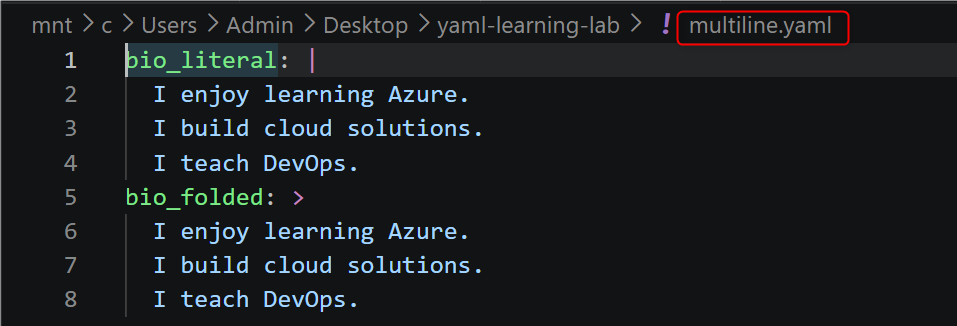
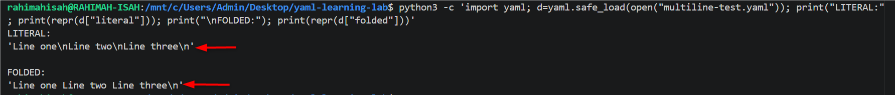
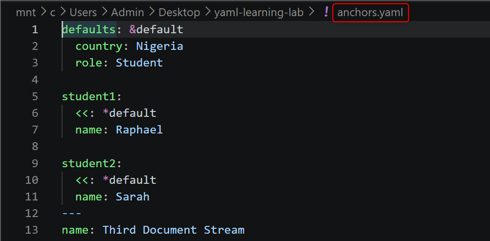
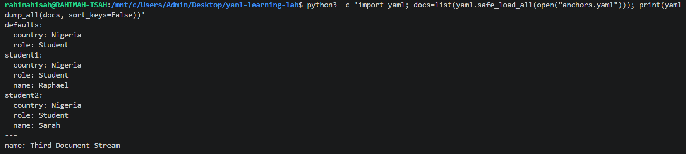
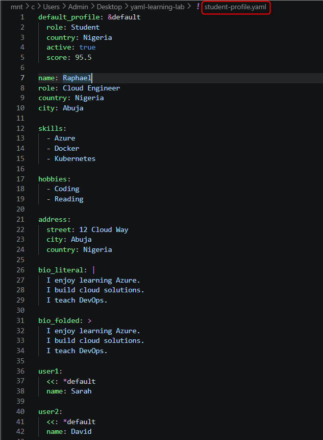

# YAML Configuration Reference

A practical reference covering YAML syntax, data structures, data types, multiline strings, anchors, aliases, multi-document streams, GitHub Actions workflows, and YAML validation.

---

## Table of Contents

1. [YAML Fundamentals](#1-yaml-fundamentals)
2. [Mappings and Nested Structures](#2-mappings-and-nested-structures)
3. [Sequences](#3-sequences)
4. [Lists of Objects](#4-lists-of-objects)
5. [YAML Data Types](#5-yaml-data-types)
6. [Comments and Quoted Strings](#6-comments-and-quoted-strings)
7. [Multiline Strings](#7-multiline-strings)
8. [Anchors, Aliases, and Merge Keys](#8-anchors-aliases-and-merge-keys)
9. [Multi-Document YAML](#9-multi-document-yaml)
10. [GitHub Actions Workflow](#10-github-actions-workflow)
11. [YAML Validation](#11-yaml-validation)
12. [Final Configuration Challenge](#12-final-configuration-challenge)
13. [Key Takeaways](#13-key-takeaways)

---

## 1. YAML Fundamentals

YAML is a human-readable data serialization format commonly used for configuration files, cloud infrastructure, CI/CD pipelines, Kubernetes resources, and automation tools.

YAML primarily represents information using **key-value pairs**.

### Example

```yaml
name: Raphael
role: Cloud Engineer
country: Nigeria
```

Each key is associated with a value:

| Key | Value |
|---|---|
| `name` | `Raphael` |
| `role` | `Cloud Engineer` |
| `country` | `Nigeria` |

The example is contained in:

```text
lesson1.yaml
```

### YAML indentation

YAML uses indentation to represent hierarchy.

Spaces should be used for indentation rather than tabs.

---

## 2. Mappings and Nested Structures

A mapping groups related properties under a common key.

### Example

```yaml
person:
  name: Raphael
  role: Cloud Engineer
```

Here, `person` contains two nested properties:

```text
person
├── name
└── role
```

Mappings can contain additional properties:

```yaml
person:
  name: Raphael
  age: 30
  country: Nigeria
```

These examples are contained in:

```text
lesson2.yaml
lesson3.yaml
```

### Why indentation matters

Indentation establishes relationships between keys.

```yaml
person:
  name: Raphael
```

In this example, `name` belongs to `person`.

Incorrect indentation can change the structure of the data or cause a **YAML parsing error**.

---

## 3. Sequences

A sequence represents an ordered list of values.

YAML uses a hyphen (`-`) to identify each item.

### Example

```yaml
skills:
  - Azure
  - Docker
  - Kubernetes
  - Git
```

The `skills` key contains four values.

The example is contained in:

```text
lesson4.yaml
```

Sequences are commonly used to represent collections such as:

- Skills
- Ports
- Packages
- Hosts
- Resources
- Configuration options

---

## 4. Lists of Objects

A YAML sequence can contain mappings, allowing each list item to have multiple properties.

### Example

```yaml
employees:
  - name: Raphael
    role: Cloud Engineer
  - name: Sarah
    role: DevOps Engineer
  - name: David
    role: Solution Architect
```

Each employee is an object containing a `name` and a `role`.

Conceptually:

```text
employees
├── employee
│   ├── name
│   └── role
├── employee
│   ├── name
│   └── role
└── employee
    ├── name
    └── role
```

The example is contained in:

```text
lesson5.yaml
```

This structure is useful for representing collections of structured resources in configuration files.

---

## 5. YAML Data Types

YAML supports several common data types.

### Example

```yaml
person:
  name: Raphael
  age: 30
  salary: 4500.50
  active: true
  verified: false
  phone: null
```

The example demonstrates:

| Value | Data Type |
|---|---|
| `Raphael` | String |
| `30` | Integer |
| `4500.50` | Floating-point number |
| `true` | Boolean |
| `false` | Boolean |
| `null` | Null |

YAML also supports nested mappings:

```yaml
address:
  city: Abuja
  country: Nigeria
```

The complete example is contained in:

```text
lesson6.yaml
```

---

## 6. Comments and Quoted Strings

Comments begin with the `#` character.

### Example

```yaml
# Employee Information Configuration
city: Lagos
```

Comments are ignored by YAML parsers and can be used to explain configuration.

YAML also supports quoted strings.

```yaml
message: "Welcome: Cloud Engineers!"
```

Quoting can make the intended value explicit, especially when the value contains characters that may have special meaning in YAML.

The example is contained in:

```text
lesson7.yaml
```

---

## 7. Multiline Strings

YAML provides **block scalar syntax** for storing multiline text. Two commonly used block scalar styles are:

- `|` — **literal block**: preserves line breaks.
- `>` — **folded block**: folds line breaks into spaces.

The difference becomes clear when the YAML is actually parsed.

### Literal Block: `|`

The `|` character tells YAML to preserve the line breaks within the value.

```yaml
bio_literal: |
  I enjoy learning Azure.
  I build cloud solutions.
  I teach DevOps.
```

When parsed, the resulting value contains newline characters:

```text
'I enjoy learning Azure.\nI build cloud solutions.\nI teach DevOps.\n'
```

The output is therefore:

```text
I enjoy learning Azure.
I build cloud solutions.
I teach DevOps.
```

Each line remains on its own line.

### Folded Block: `>`

The `>` character tells YAML to fold the line breaks between ordinary text lines into spaces.

```yaml
bio_folded: >
  I enjoy learning Azure.
  I build cloud solutions.
  I teach DevOps.
```

When parsed, the resulting value becomes:

```text
'I enjoy learning Azure. I build cloud solutions. I teach DevOps.\n'
```

The output is therefore:

```text
I enjoy learning Azure. I build cloud solutions. I teach DevOps.
```

The lines are written separately in the YAML file for readability, but YAML folds them into a single paragraph-like value.

### Comparing `|` and `>`

| Syntax | Behavior | Parsed result |
|---|---|---|
| `\|` | Preserves line breaks | Each line remains separate |
| `>` | Folds ordinary line breaks into spaces | Lines become part of one continuous paragraph |

A simple way to remember the difference:

```text
|  → preserve line breaks
>  → fold line breaks into spaces
```

### Verifying the Difference with Python and PyYAML

The difference can be confirmed by parsing the YAML with PyYAML and displaying the Python string representation.

For example:

```bash
python3 -c 'import yaml; d=yaml.safe_load(open("multiline-test.yaml")); print("LITERAL:"); print(repr(d["literal"])); print("\nFOLDED:"); print(repr(d["folded"]))'
```

The parsed output demonstrates the difference:

```text
LITERAL:
'Line one\nLine two\nLine three\n'

FOLDED:
'Line one Line two Line three\n'
```

Here, `\n` represents a newline character.

Therefore:

- `|` preserves the newline characters between the lines.
- `>` replaces the ordinary line breaks with spaces.

This distinction is particularly useful when YAML contains **shell scripts, CI/CD commands, configuration blocks, descriptions, or other multiline content**.





---

## 8. Anchors, Aliases, and Merge Keys

YAML provides **anchors, aliases, and merge keys** for defining configuration once and reusing it in other mappings.

These features are useful when multiple objects share common configuration values.

The three symbols used in this section are:

| Symbol | Purpose |
|---|---|
| `&` | Creates an anchor |
| `*` | References an anchor using an alias |
| `<<` | Merges the referenced mapping into another mapping |

### Defining an Anchor with `&`

An anchor is created using `&` followed by the name of the anchor.

```yaml
defaults: &default
  country: Nigeria
  role: Student
```

In this example:

```text
&default
```

creates an anchor named `default`.

The anchor stores the following mapping:

```yaml
country: Nigeria
role: Student
```

Instead of repeating these properties for every student, the configuration can be reused.

### Referencing the Anchor with `*`

An alias is created using `*` followed by the name of an existing anchor.

```yaml
student1:
  <<: *default
  name: Raphael
```

Here:

```text
*default
```

references the configuration stored under the `default` anchor.

### Understanding the `<<` Merge Key

The `<<` symbol is the YAML **merge key**.

It tells YAML to merge the mapping referenced by the alias into the current mapping.

In:

```yaml
student1:
  <<: *default
  name: Raphael
```

the following:

```yaml
<<: *default
```

merges:

```yaml
country: Nigeria
role: Student
```

into `student1`.

The resulting mapping is effectively:

```yaml
student1:
  country: Nigeria
  role: Student
  name: Raphael
```

### Reusing the Same Anchor

The same anchor can be reused for another object:

```yaml
student2:
  <<: *default
  name: Sarah
```

This produces:

```yaml
student2:
  country: Nigeria
  role: Student
  name: Sarah
```

Both students reuse the same `country` and `role` values without having to repeat them.

### Complete Lab Example

The complete example used in this lab is:

```yaml
defaults: &default
  country: Nigeria
  role: Student

student1:
  <<: *default
  name: Raphael

student2:
  <<: *default
  name: Sarah
```

The process can be understood as:

```text
&default
    ↓
Creates the reusable anchor

*default
    ↓
References the anchor

<<: *default
    ↓
Merges the anchored properties into the current mapping
```

### Actual Parsed Result

The YAML can be parsed with PyYAML to verify what the anchor, alias, and merge key produce.

For example:

```bash
python3 -c 'import yaml; d=yaml.safe_load(open("anchors.yaml")); print(yaml.dump(d, sort_keys=False))'
```

The resulting configuration should be:

```yaml
defaults:
  country: Nigeria
  role: Student
student1:
  country: Nigeria
  role: Student
  name: Raphael
student2:
  country: Nigeria
  role: Student
  name: Sarah
```

This demonstrates that the values defined once under `defaults` have been incorporated into both `student1` and `student2`.

### Why Anchors, Aliases, and Merge Keys Are Useful

Anchors and aliases can help:

- Reduce configuration duplication
- Reuse common settings
- Keep related configuration consistent
- Make large configuration files easier to maintain
- Apply shared configuration to multiple objects

The complete lab example is contained in:

```text
anchors.yaml
```





---
## 9. Multi-Document YAML

A YAML file can contain **multiple independent YAML documents**. Each document can contain its own mappings, sequences, or other YAML structures.

The document separator is:

```yaml
---
```

The `---` separator marks the beginning of a new YAML document.

### Practical Example

The `anchors.yaml` file used in this lab contains two YAML documents:

```yaml
defaults: &default
  country: Nigeria
  role: Student

student1:
  <<: *default
  name: Raphael

student2:
  <<: *default
  name: Sarah
---
name: Third Document Stream
```

The first document contains the `defaults`, `student1`, and `student2` mappings.

The `---` separator then starts a second, independent document:

```yaml
name: Third Document Stream
```

The file therefore contains:

```text
Document 1
    ↓
defaults
student1
student2

---
    
Document 2
    ↓
name: Third Document Stream
```

### Viewing the YAML File

The contents of the file can be displayed directly in the terminal:

```bash
cat anchors.yaml
```

This shows the YAML source, including the `---` document separator.

### Parsing Multiple YAML Documents

When a YAML file contains multiple documents, PyYAML provides:

```python
yaml.safe_load_all()
```

to read all documents in the file.

The following command parses the actual `anchors.yaml` file and displays each document separately:

```bash
python3 -c 'import yaml; docs=list(yaml.safe_load_all(open("anchors.yaml"))); [print(f"DOCUMENT {i}:\n{yaml.dump(doc, sort_keys=False)}") for i, doc in enumerate(docs, 1)]'
```

The output demonstrates that the `---` separator has created two independent documents:

```text
DOCUMENT 1:
defaults:
  country: Nigeria
  role: Student
student1:
  country: Nigeria
  role: Student
  name: Raphael
student2:
  country: Nigeria
  role: Student
  name: Sarah

DOCUMENT 2:
name: Third Document Stream
```

The important point is that the parser does **not** treat the entire file as one mapping. It returns two separate YAML documents.

### `safe_load()` vs `safe_load_all()`

For a file containing a single YAML document, `yaml.safe_load()` is sufficient:

```python
yaml.safe_load()
```

For a file containing multiple documents, use:

```python
yaml.safe_load_all()
```

For example:

```python
documents = list(yaml.safe_load_all(open("anchors.yaml")))
```

The `list()` converts the returned document iterator into a list, allowing all documents to be accessed and processed.

The first document can be accessed with:

```python
documents[0]
```

and the second document with:

```python
documents[1]
```

### Why Multi-Document YAML Is Useful

Multiple YAML documents can be useful when related but independent configurations need to be stored in the same file.

Common examples include:

- Kubernetes manifests
- Deployment configurations
- Infrastructure definitions
- CI/CD configuration
- Multiple related resources

The `anchors.yaml` file in this repository demonstrates both **YAML anchors and aliases** and **multiple YAML documents**.

The first document demonstrates:

```text
&default  → anchor
*default  → alias
<<        → merge key
```

The second document demonstrates:

```text
---       → document separator
```

The complete example is contained in:

```text
anchors.yaml
```
---

## 10. GitHub Actions Workflow

YAML is widely used to define CI/CD workflows.

The repository includes a GitHub Actions workflow in:

```text
workflow.yaml
```

### Complete workflow

```yaml
name: Build Project

on:
  push:

jobs:
  build:
    runs-on: ubuntu-latest
    steps:
      - uses: actions/checkout@v4
      - run: echo "Building project..."
```

### Workflow name

```yaml
name: Build Project
```

Defines the name of the workflow.

### Trigger

```yaml
on:
  push:
```

Specifies that the workflow is triggered when changes are pushed to the repository.

### Job

```yaml
jobs:
  build:
```

Defines a job named `build`.

### Runner

```yaml
runs-on: ubuntu-latest
```

Specifies the GitHub-hosted runner used to execute the job.

### Steps

```yaml
steps:
  - uses: actions/checkout@v4
  - run: echo "Building project..."
```

The first step uses the GitHub Actions checkout action to retrieve repository contents.

The second step executes a shell command.

---


YAML indentation should use spaces rather than tabs.

The repository checks for tab characters with:

```bash
grep -n $'\t' *.yaml || echo 'No illegal tab characters found!'
```

If no tabs are found, the command prints:

```text
No illegal tab characters found!
```

---

## 11. YAML Validation

YAML configuration should be validated before being used by automation systems. A syntax error, incorrect indentation, or unsupported structure can cause a deployment, CI/CD pipeline, or automation task to fail.

This repository uses **Python**, **PyYAML**, and standard Linux commands to validate the YAML files.

### Validate all YAML documents

```bash
python3 -c 'import yaml, glob; [list(yaml.safe_load_all(open(f))) for f in glob.glob("*.yaml")]; print("All YAML files valid!")'
```

The validation result is captured in [12-yaml-validation.png](../screenshots/12-yaml-validation.png).

### Breaking down the command

| Part | Meaning |
|---|---|
| `python3` | Starts Python 3. |
| `-c` | Tells Python to execute the code supplied directly in the command rather than from a `.py` file. |
| `'...'` | Single quotes make Bash treat the entire Python expression as one argument. They also prevent Bash from interpreting special characters inside the command. |
| `import yaml` | Imports **PyYAML**, the Python YAML parsing library. |
| `import glob` | Imports Python's `glob` module, which can find files matching patterns. |
| `glob.glob("*.yaml")` | Finds all files in the current directory ending in `.yaml`. |
| `open(f)` | Opens each YAML file for reading. |
| `yaml.safe_load_all(...)` | Safely parses all YAML documents contained in a file. This is important because a YAML file can contain multiple documents separated by `---`. |
| `list(...)` | Consumes the document generator returned by `safe_load_all()` and forces every document to be parsed. |
| `[ ... for f in ... ]` | A Python list comprehension that performs the validation for every `.yaml` file found. |
| `;` | Separates multiple Python statements written on the same line. |
| `print(...)` | Displays the success message after all files have been parsed successfully. |

### Why `safe_load_all()`?

A normal `yaml.safe_load()` expects a single YAML document.

The repository contains `anchors.yaml`, which includes multiple documents separated by:

```yaml
---
```

Therefore, the validation command uses:

```python
yaml.safe_load_all()
```

This allows the validator to process every document in the YAML stream.

If a YAML file contains invalid syntax, PyYAML raises an error instead of printing the success message.

---

### Check for illegal tab characters

YAML indentation should use **spaces rather than tab characters**.

The repository checks for tab characters with:

```bash
grep -n $'\t' *.yaml || echo 'No illegal tab characters found!'
```

The result is also captured in [12-yaml-validation.png](../screenshots/12-yaml-validation.png).

### Breaking down the command

| Part | Meaning |
|---|---|
| `grep` | Searches files for a specified pattern. |
| `-n` | Displays the line number where a match is found. |
| `$'\t'` | Bash syntax representing a literal tab character. |
| `*.yaml` | Targets every `.yaml` file in the current directory. |
| `\|\|` | Bash OR operator. The command on the right runs only if the command on the left fails. |
| `echo` | Prints text to the terminal. |
| `'No illegal tab characters found!'` | The message displayed when no tab characters are detected. |

### Understanding the logic

The command can be read as:

> Search every YAML file for a tab character. If no tab is found, print a confirmation message.

If tabs are found, `grep` reports the matching file and line number.

If no tabs are found, `grep` returns a non-zero exit status, causing the command after `||` to execute:

```text
No illegal tab characters found!
```

### Validation result

The validation process therefore checks two important areas:

1. **YAML syntax and document structure** using Python and PyYAML.

2. **Indentation safety** by checking for illegal tab characters.

Together, these checks help ensure that the YAML files are syntactically valid and consistently formatted before they are used by automation or DevOps tooling.

## 12. Final Configuration Challenge

The `student-profile.yaml` file combines multiple YAML concepts into a single configuration.

It demonstrates:

- Mappings
- Nested mappings
- Sequences
- Strings
- Integers
- Floating-point values
- Booleans
- Multiline strings
- Folded strings
- Anchors
- Aliases
- Merge keys

### Shared configuration

```yaml
default_profile: &default
  role: Student
  country: Nigeria
  active: true
  score: 95.5
```

The `&default` anchor allows this configuration to be reused.

### Reusing the configuration

```yaml
user1:
  <<: *default
  name: Sarah

user2:
  <<: *default
  name: David
```

The merge key `<<` imports the values defined by the `default` anchor.

### Sequences

The file also contains lists:

```yaml
skills:
  - Azure
  - Docker
  - Kubernetes

hobbies:
  - Coding
  - Reading
```

### Nested mappings

The address is represented as a nested mapping:

```yaml
address:
  street: 12 Cloud Way
  city: Abuja
  country: Nigeria
```

### Multiline content

The configuration also demonstrates both multiline styles:

```yaml
bio_literal: |
  I enjoy learning Azure.
  I build cloud solutions.
  I teach DevOps.

bio_folded: >
  I enjoy learning Azure.
  I build cloud solutions.
  I teach DevOps.
```
### Practical Verification

The `student-profile.yaml` file can be parsed with PyYAML using `yaml.safe_load()`:

```bash
python3 -c 'import yaml; data=yaml.safe_load(open("student-profile.yaml")); print(yaml.dump(data, sort_keys=False))'
```

This parses the YAML and displays the resulting configuration, including the resolved anchor and merged properties.

The result can be captured in `11-student-profile-challenge.png`

.

This makes `student-profile.yaml` a consolidated example of the YAML structures and syntax covered throughout the repository.

---

## 13. Key Takeaways

This repository demonstrates practical YAML configuration patterns used across cloud and DevOps environments.

### Core YAML concepts

- Key-value pairs
- Mappings
- Nested mappings
- Sequences
- Lists of objects
- Data types
- Comments
- Quoted strings
- Multiline strings

### Advanced YAML concepts

- Anchors
- Aliases
- Merge keys
- Multi-document YAML streams

### DevOps applications

- GitHub Actions workflow configuration
- Configuration management
- YAML validation
- Automation configuration
- Structured cloud and DevOps data

The combination of these patterns provides a foundation for working with YAML-based configuration across modern cloud and DevOps tooling.
